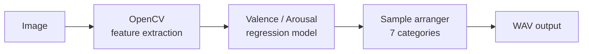

<div class="syn-cover">

<div class="syn-eyebrow">multimodal ai · v0.4 beta</div>

# Synorva

<div class="syn-lead">

Turning an image into <span class="it">music.</span>

</div>

<p class="syn-sub">
Reads the emotion of an image and generates a matching audio track — mapped through a valence / arousal model.
</p>

</div>

<div class="abs-br m-6 syn-credit">
Anaïs · sup4nova.com · github.com/sup4nova/Synorva
</div>

<!-- Slide 1 — COVER. Add a nice app screenshot as background if you want. -->

---
layout: center
class: syn-center
---

<div class="syn-eyebrow">where it started</div>

# Two passions, <span class="it">one project.</span>

I wanted to bring together my two passions — **music and tech** — into one project.

So I dived into generative AI, took a few courses, and along the way learned music
production from the ground up: working in a DAW, understanding samples, and how to
label what a sound *feels* like.

That led to one question:

<div class="syn-question">

Can we translate the <span class="it">emotion of an image</span> into music — automatically?

</div>

<p class="syn-sub">Synorva is my answer.</p>

<!-- Slide 2 — THE IDEA. Short, no jargon. Shows product thinking. -->

---
layout: image-right
image: /demo.png
class: syn-demo
---

<div class="syn-eyebrow">live demo</div>

# See it <span class="it">work.</span>

Input image → detected **valence / arousal** → generated track 🎧

<div class="syn-play">▶︎ &nbsp;<a href="#">30s video demo</a></div>

<div class="syn-note">

The full pipeline (image analysis + ML + audio rendering) runs locally.
The live site shows the frontend only — shared hosting can't run the backend yet.

</div>

<!-- Slide 3 — DEMO. The slide that sells. Use the LOCAL video so it always works,
     not the live demo (backend not hosted). Show, don't tell. -->

---

<div class="syn-eyebrow">architecture</div>

# How it <span class="it">works.</span>



A single upload flows end-to-end: visual features → predicted emotion →
sample selection &amp; mixing → a rendered audio track.

<!-- Slide 4 — ARCHITECTURE. The mermaid diagram renders natively in Slidev. No wall of text. -->

---
layout: two-cols
class: syn-twocols
---

<div class="syn-eyebrow">the ml core</div>

# Trained from <span class="it">scratch.</span>

No off-the-shelf dataset exists for this:

- Collected images by emotion (Unsplash API) + audio samples from public libraries
- Extracted **11 visual features** (OpenCV) and **~30 acoustic features** (librosa)
- Labelled each into a **valence / arousal** space
- Trained a RandomForest regressor (scikit-learn)

::right::

<div class="syn-aside">

<div class="syn-aside-label">visual</div>
A valence / arousal scatter plot, or a screenshot of the training output.

</div>

<!-- Slide 5 — THE ML CORE. Your depth slide: "from scratch" is rare — make it shine. -->

---

<div class="syn-eyebrow">feature engineering</div>

# From pixels to <span class="it">feeling.</span>

How do you turn *"this image feels warm"* into a number a model can learn from?

```python
def _warmth_hue(img_bgr):
    hsv = cv2.cvtColor(img_bgr, cv2.COLOR_BGR2HSV).astype(float)
    h = hsv[..., 0] * 2.0                 # OpenCV hue 0-180 -> 0-360
    sat, val = hsv[..., 1] / 255, hsv[..., 2] / 255
    mask = (sat > 0.15) & (val > 0.15)    # ignore grey / near-black
    warm = ((h <= 60) | (h >= 300))[mask].mean()   # reds, oranges, pinks
    cold = ((h >= 180) & (h <= 260))[mask].mean()  # blues, cyans
    return float(warm - cold)             # > 0 = warm, < 0 = cool
```

Eleven hand-crafted features like this one feed the valence / arousal model.

<!-- Slide 6 — ONE code slide, chosen to tell a story (turning intuition into signal).
     Keep it to ~10-15 lines. The rest of the code lives in the repo. -->

---
layout: center
class: syn-center
---

<div class="syn-eyebrow">stack</div>

# Built <span class="it">with.</span>

<div class="syn-stack">

<span class="syn-badge syn-badge--warm">Python</span>
<span class="syn-badge syn-badge--warm">FastAPI</span>
<span class="syn-badge syn-badge--warm">scikit-learn</span>
<span class="syn-badge syn-badge--warm">OpenCV</span>

<span class="syn-badge syn-badge--cool">librosa</span>
<span class="syn-badge syn-badge--cool">Vue 3</span>
<span class="syn-badge syn-badge--cool">TypeScript</span>
<span class="syn-badge syn-badge--cool">Docker</span>

</div>

<!-- Slide 7 — STACK. Visual, scannable, no text. -->

---

<div class="syn-eyebrow">challenges &amp; learnings</div>

# What I <span class="it">learned.</span>

<div class="syn-cards">

<div class="syn-card">
<div class="syn-card-h">🐳 &nbsp;Stale Docker images</div>
My nginx frontend kept crashing at startup *after* I'd fixed the config.
The config is baked into the image at build time — a restart reran the old one.
<div class="syn-card-l">Learned to reason about Docker layers &amp; image lifecycle, not just commands.</div>
</div>

<div class="syn-card">
<div class="syn-card-h">🏷️ &nbsp;Labelling a subjective target</div>
There's no objective ground truth for "the emotion of an image."
Designed a consistent feature → valence / arousal mapping to train on.
<div class="syn-card-l">Applied ML is often about defining the data, not just fitting a model.</div>
</div>

<div class="syn-card">
<div class="syn-card-h">🎚️ &nbsp;Turning emotion into music</div>
A valence / arousal coordinate isn't a song.
Built a sample arranger that selects &amp; mixes across 7 categories, then renders a WAV.
<div class="syn-card-l">The system <em>around</em> the model matters as much as the model itself.</div>
</div>

</div>

<!-- Slide 8 — CHALLENGES. 3 real obstacles, each as problem -> action -> learning. -->

---

<div class="syn-eyebrow">limits &amp; roadmap</div>

# What's <span class="it">next.</span>

<div class="syn-next">

<div class="syn-next-item">
<span class="syn-next-n">01</span>
<div>
<strong>Improve the model</strong>
The current image model is an early version — more and better-labelled data to push accuracy and precision.
</div>
</div>

<div class="syn-next-item">
<span class="syn-next-n">02</span>
<div>
<strong>Ship it fully</strong>
Deploy the complete pipeline on a VPS (Docker + hosted DB); shared hosting can't run the FastAPI backend today.
</div>
</div>

<div class="syn-next-item">
<span class="syn-next-n">03</span>
<div>
<strong>Go deeper on audio</strong>
Move from hand-crafted features to richer audio embeddings (CLAP / MERT).
</div>
</div>

</div>

<!-- Slide 9 — LIMITS & NEXT. Showing self-awareness = maturity. -->

---
layout: center
class: syn-close
---

<div class="syn-eyebrow">thanks 🎧</div>

# Let's <span class="it">talk.</span>

<div class="syn-links">

<div><span class="syn-links-k">live demo</span> <a href="#">link</a></div>
<div><span class="syn-links-k">code</span> <a href="#">github.com/sup4nova/Synorva</a></div>
<div><span class="syn-links-k">portfolio</span> <a href="#">sup4nova.com</a></div>
<div><span class="syn-links-k">contact</span> <a href="#">contact@sup4nova.com</a></div>

</div>

<div class="syn-wordmark">synorva<span class="it">.</span></div>

<!-- Slide 10 — CLOSE. Clear CTA: demo, repo, contact. -->